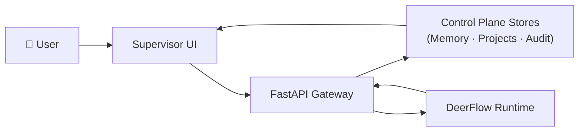

# SwarmMind

<!-- TODO: add logo -->

> **The open-source control plane for enterprise AI agents.**
> Turn organizational knowledge into governed, searchable, agent-executable context.

[](https://github.com/rongxinzy/SwarmMind/actions)
[](https://github.com/rongxinzy/SwarmMind/releases)
[](LICENSE)
[](https://www.python.org/)

[中文文档](README_zh.md) · [Architecture](docs/architecture.md) · [Roadmap](docs/roadmap.md) · [Contributing](#contributing--community)

---

## "Who in our org knows about this?"

Your team asks this every day. The answer is buried across Slack threads, meeting notes, project docs, and people's heads — and every time someone leaves or a project changes hands, that knowledge disappears.

SwarmMind makes organizational knowledge searchable and executable. Your AI agents stop hallucinating answers from thin air and start routing to the people, projects, and context that actually hold the answer.

---

## Why SwarmMind

Most AI agent frameworks focus on **orchestration** — how agents talk to each other.

SwarmMind focuses on **what agents know**: organizational memory, governance, and trust. It is a **control plane**, not a framework.

> "Orchestration is a solved problem. The hard part is making sure the right agent has the right context, the right permissions, and leaves a traceable audit trail. That's what we built."

SwarmMind is in production use in real organizational environments.

---

## Four Pillars

### 🧠 Organizational Memory

Multi-layered memory across personal, project, and organization-wide scopes. Every piece of knowledge is tracked: who created it, who can access it, and how confident the system is in its accuracy. When someone asks "who knows about X," the answer is a real route to real context — not a hallucination.

### 🤝 Multi-Agent Collaboration

Complex, multi-turn tasks with governance built in. Agents coordinate across projects, hand off work with full context, and escalate to humans when approval is required. This is not a demo pipeline — it is production-grade execution designed for organizational use.

### 🖥️ Accessible UI

Non-technical users can start a session, explore organizational knowledge, and promote findings into governed projects — in minutes, not days. No API keys, no CLI, no prompt engineering required.

### 🔌 Extensible

Plugins, Skills, and MCP tools let you customize every agent's capabilities. Connect your CRM, code repositories, OA systems, or any custom data source. The control plane handles the governance; your integrations handle the domain.

---

> SwarmMind is infrastructure that doesn't feel like infrastructure. The control plane handles governance; the UI handles humans.

---

## Architecture



SwarmMind is the **control plane**. [DeerFlow](https://github.com/hawkli-1994/deer-flow) is the runtime.

The control plane owns: identity, project boundaries, routing, approvals, traces, artifacts, and audit records. The runtime owns: agent execution, tool calls, and checkpoints.

→ [Full architecture diagram and design decisions](docs/architecture.md)

---

## How SwarmMind Compares

| Dimension | SwarmMind | CrewAI | LangGraph |
|-----------|-----------|--------|-----------|
| **Primary focus** | Governance + organizational memory | Role-based agent orchestration | Stateful graph orchestration |
| **Memory model** | Multi-layered: personal, project, org-wide | Shared memory per crew | Thread-level state |
| **Governance** | Built-in (permissions, audit trail, approvals — expanding) | Not included | Not included |
| **UI** | Built-in supervisor UI for non-technical users | No built-in UI | LangSmith (separate product) |
| **Extensibility** | Plugins, Skills, MCP tools | Tools via LangChain or custom | LangChain ecosystem |
| **Runtime** | DeerFlow (delegated) | Built-in | Built-in |
| **License** | AGPL-3.0 | MIT | MIT |

> Different tools for different problems. SwarmMind is for organizations that need governed agent execution with persistent organizational memory. CrewAI and LangGraph are excellent for developers building agent applications from scratch.

---

## Quick Start

**Prerequisites:** Python 3.12+, Node.js 20+, PostgreSQL (or a Supabase project URL)

```bash
git clone https://github.com/rongxinzy/SwarmMind.git
cd SwarmMind
cp .env.example .env   # fill in your LLM provider keys + DB URL
make install
make dev
```

After startup, open [http://localhost:3000](http://localhost:3000). You will see the ChatSession interface — type any natural-language question to start exploring your organizational context.

<!-- TODO: add screenshot of ChatSession UI -->

---

## Use Cases

**Organizational knowledge routing**
> "Who on our team has worked on payment integrations before?"

SwarmMind routes the question across project memory and personal agent profiles to surface the right person and their relevant context — not a generic web search result.

**Project memory management**
> "Catch me up on the infrastructure migration — I just joined the team."

Agents pull from project-scoped memory across sessions, preserving context between meetings, handoffs, and team changes.

**Governance and audit**
> "Show me every decision made on the Q3 budget approval, with evidence."

Every agent action, approval, and artifact is linked to a traceable audit log. Leadership gets direct answers backed by evidence, not reconstructed summaries.

---

## Project Status

SwarmMind is **v0.1.1** — early stage, in active development, and deployed in production organizational environments.

Current focus:
- **P0** — Keep ChatSession reliable; complete `Promote to Project` flow
- **P1** — Governed project execution: runs, artifacts, approvals, and audit
- **P2** — Enterprise connectors and policy intelligence

→ [Full roadmap](docs/roadmap.md)

---

## Contributing & Community

SwarmMind is open-source under AGPL-3.0. Contributions are welcome.

- [Contributing Guide](CONTRIBUTING.md) *(coming soon)*
- [Code of Conduct](CODE_OF_CONDUCT.md)
- [Security Policy](SECURITY.md)
- [Open an issue](https://github.com/rongxinzy/SwarmMind/issues/new/choose)

---

## License

[GNU Affero General Public License v3.0](LICENSE) — AGPL-3.0

---

## Acknowledgments

Built on [DeerFlow](https://github.com/hawkli-1994/deer-flow) runtime for agent execution.
