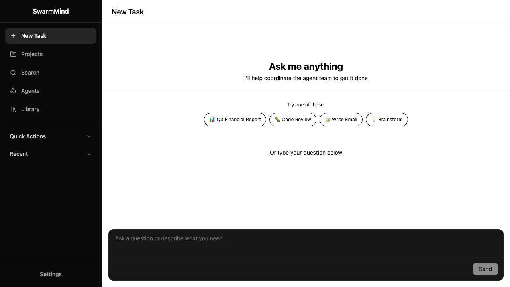

<!-- Hero Tagline + Language Switcher -->
<p align="center">
  <h1>🤖 SwarmMind</h1>
  <strong>Where intelligent work emerges from collaboration.</strong><br>
  <em>AI agent teams as primary actors — humans as referees.</em>
  <br><br>
  <a href="README_zh.md">🇨🇳 中文版</a>
</p>

<!-- Badges -->
<p align="center">

  <a href="https://github.com/rongxinzy/SwarmMind/actions/workflows/ci.yml">
    
  </a>
  
  
  
  
  
  

</p>

---

## The Problem

Every tool we build asks: *how do we help humans do knowledge work better?*

But we've never seriously asked:

> **What happens when knowledge work no longer requires humans at all?**

Not "AI assists humans." **AI agents become the primary actors.** Humans become supervisors and decision-makers — not bystanders, but referees.

SwarmMind is the answer.

---

## Old Paradigm → New Paradigm

| Tool | Old Paradigm (humans do, AI helps a little) | New Paradigm (AI agents do, humans supervise) |
|------|---------------------------------------------|---------------------------------------------|
| **Project Management** | Jira — humans create tickets, assign tasks | SwarmMind — AI routes goals, fills context gaps |
| **Knowledge Base** | Confluence — humans write & search docs | AI agents share context, LLM generates views |
| **Communication** | Slack — humans send, wait, reply | Agents write to shared context, no inbox |
| **Code Review** | GitHub PR — humans review manually | AI agents review, collaborate, self-improve |

**The shift:** *"humans are the main actors, AI is the assistant"* → ***AI agent teams are the main actors, humans are the referees.***

## Enterprise Use Cases

SwarmMind transforms how enterprises operate at scale:

| Use Case | What it replaces | Value |
|----------|-----------------|-------|
| **Automated periodic briefings** | Weekly ops digests, monthly P&L decks | Consistent, always current, zero human compilation |
| **Anomaly alerts** | Exception reports, flagged KPIs | Proactive — detects patterns humans miss |
| **Cross-system research** | "I'll need to ask 5 departments for that" | One question, aggregated across all systems |
| **Deep-dive investigations** | Days of back-and-forth with analysts | Minutes — AI reads everything, answers precisely |

---

## What is SwarmMind

SwarmMind is an **operating system for AI agent teams** — not a message queue, not a workflow engine, not another "AI assistant." It's **enterprise cognitive infrastructure**.

The core OS insight: **multiple independent entities don't need to know each other exist to collaborate** — they just share resources, and the OS coordinates access.

```
┌─────────────────────────────────────────────────────────────┐
│                     You (human supervisor)                  │
│              "What's the status of this project?"           │
└──────────────────────────┬──────────────────────────────────┘
                           │
                           ▼
┌─────────────────────────────────────────────────────────────┐
│               LLM STATUS RENDERER                           │
│     ┌───────────────────────────────────────────────────┐   │
│     │  On-demand: prose? table? Gantt? — LLM decides  │   │
│     └───────────────────────────────────────────────────┘   │
└──────────────────────────┬──────────────────────────────────┘
                           │ reads accumulated context
                           ▼
┌─────────────────────────────────────────────────────────────┐
│                    CONTEXT BROKER                           │
│     Routes goals → right agent, manages shared state        │
└──────┬──────────┬──────────┬──────────┬───────────────────┘
       │          │          │          │
       ▼          ▼          ▼          ▼
   ┌────────┐ ┌────────┐ ┌────────┐ ┌────────┐
   │Finance │ │Customer│ │  Code │ │Product │
   │ Agent  │ │ Agent  │ │Review  │ │  Data  │
   └────────┘ └────────┘ └────────┘ └────────┘
                   │
                   ▼
        ┌──────────────────────┐
        │   SHARED CONTEXT      │
        │  (all agents read &   │
        │   write one memory)   │
        └──────────────────────┘
```

**Why not message passing?** Imagine two human experts in the same room — they don't email each other, they share a whiteboard. SwarmMind is that shared room for AI agents.

**For Enterprises — the "Last Mile" AI Connector**

While big tech builds general AI frameworks, SwarmMind solves a different problem: connecting your existing enterprise data to AI capabilities that actually ship to production.

Most enterprises have data scattered across OA systems, CRM, finance, HR, legacy platforms — but their AI initiatives stall at the PoC stage because no one has solved the "last mile" of data integration, permissions, and operational workflows. SwarmMind is that bridge: we aggregate your internal data via MCP/Skills protocols, wrap it with governance and audit controls, and give your team — especially decision-makers who don't write code — a way to actually interrogate that data like a research conversation.

**The Information Decay Problem**

In a traditional company, information from the shop floor takes weeks to reach the CEO — filtered through layers of management, summarized in presentations, stripped of nuance. By the time it reaches a decision-maker, the signal has degraded: exceptions get normalized, context disappears, and early warning signs get smoothed into scheduled reports.

This isn't a communication failure — it's structural. The same reporting hierarchy that distributes authority also filters information.

Leaders who see this clearly (Zuckerberg reportedly building a personal AI to cut through corporate hierarchy is one signal) are moving toward direct data access. SwarmMind gives every organization that capability. Your leadership team can ask:

- *"What caused this month's gross margin decline?"*
- *"What common patterns predict customer churn?"*
- *"Which projects are behind schedule and why?"*

Not static dashboards. Not scheduled reports. A live conversation with your organization's data — one that can be queried deeply, challenged, and refined.

**Enterprise-Grade Foundation**

SwarmMind is built for production use from day one: syscall and MCP permission boundaries, data classification, audit logs, and rollback support for critical operations. We don't treat security as an afterthought.

---

## Supervisor UI

The human supervisor interface for interacting with the AI agent team — sidebar navigation with a chat-first experience:

- **Tasks** (default) — Chat with the agent team. Messages route to specialized agents based on context keywords. Unmatched queries fall back to the LLM Status Renderer.
- **Projects / Search / Agents / Library** — Reserved for Phase 2.



---

## State is Context, Not Jira

Jira: `ticket.status = "In Progress"` → rigid, schema-enforced, forces work into 4 states.

**Real work never follows a 4-state flow.** A design iteration is simultaneously "draft," "in review," "waiting on client," and "partially done" — but Jira forces you to pick one.

### SwarmMind's answer:

> **State is not data. State is context.**

When you give an agent "write the quarterly financial report," the agent needs:
- **What's already there?** → existing context
- **What's missing?** → context gap detection
- **Who fills the gap?** → routes to the right agent

When all gaps are filled, the report writes itself. **No "In Progress," no tickets, no sub-tasks.**

Human asks "what's the status?" → LLM reads shared context → generates the best view (table, Gantt, or prose), **dynamically chosen by the LLM**.

---

## Self-Evolution: The Team Gets Smarter

Every existing AI system starts fresh every conversation. SwarmMind fixes this with **strategy tables**:

```
 Situation                  Routed to        Success Rate
────────────────────────────────────────────────────────────
"Quarterly financial R."   → Finance Agent      92%
"Python code review"       → Code Agent         87%
"Customer complaint"       → CS Agent           71%  ← needs improvement
"Competitive analysis"     → ???                0%  ← new situation
```

The system observes: which situation → which agent → approved or rejected → achieved goal?

Based on these signals, the system **automatically updates routing strategy** — supervised by humans, instantly effective, fully auditable.

**Not fine-tuning. Rule-based, observable, reversible learning.**

---

## Why Open Source

Because this is **infrastructure for your enterprise's brain**. No one entrusts a black box with their cognitive infrastructure.

The open source community will contribute: new agent types, better routing algorithms, novel collaboration patterns.

**Geek spirit:** making AI agent teams truly collaborate, self-evolve, and exhibit emergent intelligence. This isn't "another SaaS tool." It's rethinking the nature of knowledge work from first principles.

---

## Roadmap

| Phase | Focus | Status |
|-------|-------|--------|
| **Phase 1** | Core system: multi-agent routing, shared context, supervisor approval flow | ✅ Complete |
| **Phase 2a** | **Collaboration Trace Visibility** — replay the full agent reasoning process after each task | 🚧 In Progress |
| **Phase 2b** | **Real-time Collaboration + Human Guidance** — live SSE stream, intervention API, user accounts | 📋 Planned |
| **Phase 3** | **Dynamic Agent Onboarding + Autonomous Mode** — system proposes new agents, confident tasks auto-execute | 📋 Planned |
| **Phase 2c** | **Enterprise Data Connectors** — pre-built MCP integrations for common enterprise systems (OA, CRM, finance) | 📋 Planned |
| **Phase 3b** | **Private Skills Marketplace** — white-listable plugin ecosystem for enterprise-extensible agent capabilities | 📋 Planned |

### Phase 2a: Collaboration Trace Visibility

> The core differentiator vs. single-turn chat: users can **see how the team thinks**.

Each agent writes its reasoning steps to `event_log` during execution. After a task completes, users can replay the full collaboration timeline — every step expanded, every thought visible.

```
Task submitted
       │
       ▼
  Context Broker routes goal
       │
       ▼
  Agent A (Finance) — thinking... ──▶ event_log: reasoning step 1
       │                                           │
       ▼                                           ▼
  Shared Memory write                         event_log: reasoning step 2
       │                                           │
       ▼                                           ▼
  Agent B (Code Review) — thinking...        event_log: reasoning step 3
       │
       ▼
  Task complete → User replays full trace (expandable timeline)
```

**Phase 2a delivers:**
- `event_log` schema extension (reasoning, status, parent events)
- `GET /tasks/{id}/trace` API — full collaboration history
- Replay UI — step-by-step playback with configurable speed
- Public task links (UUID-based, no login required)

### Phase 2b: Real-time + Human Guidance

> Watch the team work. Step in only when it matters.

SSE-powered live streaming of agent reasoning to the browser. Humans can inject guidance messages at any time — the agent receives them as extra context and decides whether to adopt.

**Phase 2b adds:**
- SSE real-time stream (`GET /tasks/{id}/stream`)
- Human intervention API (`POST /tasks/{id}/guidance`)
- Max 3 interventions per task (prevents micromanagement)
- User accounts + session management
- Task history per user

### Phase 3: Dynamic Team Growth

- System detects "unknown situation" → proposes new agent type
- Supervisor approves → agent auto-registers with strategy table
- Confident tasks (>90% success history) auto-execute without approval
- Phase 3 is when the team truly **self-evolves**

---

## Phase 1 Goals

> *"An AI agent team that collaborates on knowledge work, learns from every task, and answers 'how's the project going?' with an AI-generated real-time summary — not a Jira table."*

| # | Component | Description |
|---|-----------|-------------|
| 1 | **Two Specialized Agents** | Finance Q&A agent + Code review agent |
| 2 | **Shared Context Layer** | All agents read/write one memory |
| 3 | **Context Broker** | Routes goals to the right agent |
| 4 | **LLM Status Renderer** | On-demand status summaries (prose/table/Gantt) |
| 5 | **Human Supervisor Interface** | Chat-based UI — submit goals, view agent responses |
| 6 | **Strategy Table** | Records routing rules, tracks success rate |

---

## Quick Start

```bash
# Clone the repo
git clone https://github.com/rongxinzy/SwarmMind.git
cd SwarmMind

# Backend: install dependencies with uv (fast, correct)
uv sync

# Set your LLM API key (copy .env.example → .env and fill in)
cp .env.example .env

# Start the supervisor API
# DB is configured by SWARMMIND_DATABASE_URL and schema init mode by SWARMMIND_DB_INIT_MODE
uv run python -m swarmmind.api.supervisor
# API runs at http://localhost:8000

# Frontend: install UI dependencies (new terminal)
cd ui && npm install && npm run dev
# UI runs at http://localhost:3000
```

**Workflow:** Open the UI at http://localhost:3000 → select a conversation or start a new one → type a question. Messages are routed to Finance or Code Review agents when keywords match, or answered directly by the LLM.

---

## Architecture

| Layer | Component | Responsibility |
|-------|------------|-----------------|
| **Human Interface** | Supervisor UI (shadcn/ui) + LLM Status Renderer | Submit goals, approve/reject, view status |
| **Orchestration** | Context Broker | Routes goals to agents via strategy table |
| **Agent Layer** | Finance Agent, Code Review Agent | Specialized domain actors with LLM inference |
| **Memory Layer** | Shared Context (ORM + Alembic, config-switched dialect) | Persistent shared memory, conflict-resolved |
| **Supervisor API** | FastAPI REST API | Human oversight and approval endpoints |

---

## Project Status

🟡 **Phase 1 — Complete** | 🚧 **Phase 2a — In Progress**

### Phase 1 — Complete
- [x] Project concept & design
- [x] Context Broker implementation
- [x] Finance + Code Review agents
- [x] Shared context layer (ORM-backed, SQLite local/dev default, config-switched for PostgreSQL/MySQL)
- [x] Supervisor REST API (6 endpoints + pagination)
- [x] Supervisor UI (React + shadcn/ui, 3 tabs)
- [x] LLM Status Renderer
- [x] Strategy table with success tracking
- [x] Action proposal timeout (5 min)
- [x] Core tests
- [x] Chat conversation with streaming + persistence

### Phase 2a — In Progress
- [ ] `event_log` schema extension (reasoning, status, parent_event_id)
- [ ] `act()` returns EventLogEntry alongside ActionProposal
- [ ] `GET /tasks/{id}/trace` API
- [ ] Replay UI (timeline + expandable steps + playback controls)
- [ ] Public task link sharing (UUID-based, no auth)

---

## Contributing

Contributions welcome. This is an open experiment in AI-native infrastructure.

- Fork the repo
- Read the [design doc](./docs/design.md) for architecture context
- Open an issue before submitting large PRs

---

## License

Apache 2.0 — see [LICENSE](LICENSE)

---

<p align="center">

🇨🇳 <a href="README_zh.md">中文版</a>

*SwarmMind — where intelligent work emerges from collaboration.*

</p>
