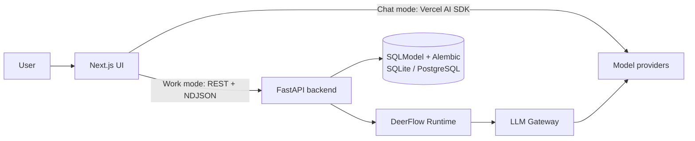

# SwarmMind

<!-- TODO: add logo -->

> **An open-source, self-hosted agent chat app. Plain B/S architecture.**
> Chat directly with models, run agent tasks, organize work into projects, and manage your org's accounts, models, and MCP permissions.

[](https://github.com/rongxinzy/SwarmMind/actions)
[](https://github.com/rongxinzy/SwarmMind/releases)
[](LICENSE)
[](https://www.python.org/)

[中文文档](README_zh.md) · [Architecture](docs/architecture.md) · [CLI](docs/cli.md) · [Roadmap](docs/roadmap.md) · [Contributing](#contributing--community)

---

## What It Is

SwarmMind is a straightforward browser/server chat application with two modes, switched from the top of the sidebar:

**Chat mode** — talk to a model directly. No agent runtime, no plans, no orchestration. The frontend connects via the Vercel AI SDK; the model list is whatever your admin allocated to you.

**Work mode** — agent work. Two things live here:

- **Tasks**: agent sessions executed by the [DeerFlow](https://github.com/hawkli-1994/deer-flow) runtime. The agent plans, calls tools and MCP servers, and streams its progress.
- **Projects**: a workspace folder that holds multiple task sessions. All sessions inside a project share the project's memory.

Plus **organization admin** for the admin role:

- two-level structure: organization → teams → members;
- create accounts and assign members to teams;
- allocate quota and models per org / team / member;
- grant custom MCP server permissions.

That's the whole product. No approval workflows, no connector platform, no template marketplace, no governance center.

---

## Architecture


```mermaid
flowchart LR
  U["User"] --> UI["Next.js UI"]
  UI -->|"Chat mode: Vercel AI SDK"| LLM["Model providers"]
  UI -->|"Work mode: REST + NDJSON"| API["FastAPI backend"]
  API --> RT["DeerFlow Runtime"]
  RT --> GW["LLM Gateway"]
  GW --> LLM
  API --> DB[("SQLModel + Alembic<br/>SQLite / PostgreSQL")]
```

DeerFlow is the execution kernel for task sessions only; Chat sessions never touch it.

→ [Full architecture document](docs/architecture.md)

---

## Quick Start

**Prerequisites:** Python 3.12+, Node.js 20+, PostgreSQL or SQLite for local development.

```bash
git clone https://github.com/rongxinzy/SwarmMind.git
cd SwarmMind
cp .env.example .env   # fill in your LLM provider keys + DB URL
make install
make dev
```

After startup, open [http://localhost:3000](http://localhost:3000).

CLI is a first-class interface alongside the web UI:

```bash
swarmmind health
swarmmind user create ada@example.com --password "change-me-now" --role admin
swarmmind auth login ada@example.com --password "change-me-now"
swarmmind chat new "Summarize this week's incident reports"
swarmmind project list --json
```

See [CLI documentation](docs/cli.md) for commands, JSON/NDJSON output, exit codes, and MCP mode.

<!-- TODO: add screenshot of the Chat / Work mode sidebar -->

---

## Project Status

SwarmMind is **v0.1.1**: early stage and actively developed.

Current milestones:

- **M0**: prune legacy surfaces down to the four product faces.
- **M1**: Chat mode — direct model chat over the Vercel AI SDK.
- **M2**: task sessions on the DeerFlow runtime.
- **M3**: projects — workspace folders, multiple sessions, shared project memory.
- **M4**: org admin — teams, accounts, quota, model allocation, MCP grants.

→ [Full roadmap](docs/roadmap.md)

---

## Contributing & Community

SwarmMind is open-source under AGPL-3.0. Contributions are welcome.

- [Contributing Guide](CONTRIBUTING.md) *(coming soon)*
- [Code of Conduct](CODE_OF_CONDUCT.md)
- [Security Policy](SECURITY.md)
- [Open an issue](https://github.com/rongxinzy/SwarmMind/issues/new/choose)

---

## License

[GNU Affero General Public License v3.0](LICENSE) — AGPL-3.0

---

## Acknowledgments

Built on the [DeerFlow](https://github.com/hawkli-1994/deer-flow) runtime for agent task execution.
