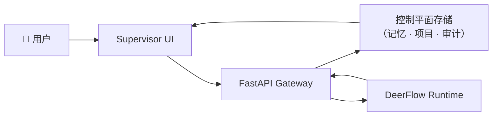

# SwarmMind

<!-- TODO: add logo -->

> **面向企业 AI Agent 的开源控制平面。**
> 将组织知识转化为可治理、可检索、可执行的上下文。

[](https://github.com/rongxinzy/SwarmMind/actions)
[](https://github.com/rongxinzy/SwarmMind/releases)
[](LICENSE)
[](https://www.python.org/)

[English](README.md) · [技术架构](docs/architecture.md) · [路线图](docs/roadmap.md) · [参与贡献](#参与贡献--社区)

---

## "我们组织里谁最了解这件事？"

每天都有人在问这个问题。答案埋在 Slack 消息、会议记录、项目文档和各人脑子里——每次有人离职或项目交接，这些知识就悄无声息地消失了。

SwarmMind 让组织知识变得可检索、可执行。你的 AI Agent 不再凭空生成答案，而是准确路由到真正掌握信息的人、项目和上下文。

---

## 为什么是 SwarmMind

大多数 AI Agent 框架解决的是**编排问题**——Agent 之间怎么对话。

SwarmMind 解决的是 **Agent 知道什么**：组织记忆、治理机制和信任体系。它是一个**控制平面**，而不是框架。

> "编排是一个已经被解决的问题。真正的难点是：让正确的 Agent 拥有正确的上下文、正确的权限，并留下可追溯的审计轨迹。这才是我们构建的东西。"

SwarmMind 已在真实的组织环境中生产部署使用。

---

## 四大核心能力

### 🧠 组织记忆

跨越个人、项目、组织三个层级的多层记忆体系。每一条知识都被追踪：谁创建的、谁有权限访问、系统对其准确性的置信度。当有人问"谁了解 X"，答案是真实的路由，而不是一次幻觉。

### 🤝 多 Agent 协作

内置治理机制的复杂多轮任务执行。Agent 跨项目协作，携带完整上下文移交工作，在需要人工审批时自动上报。这不是演示流水线，而是为组织级使用设计的生产级执行能力。

### 🖥️ 开箱即用的界面

非技术人员无需 API 密钥、无需命令行、无需学习 Prompt 工程——打开界面就能开始会话、检索组织知识，并将发现推进为正式项目。

### 🔌 高度可扩展

通过插件、Skill 和 MCP 工具自定义每个 Agent 的能力。接入你的 CRM、代码仓库、OA 系统或任何自定义数据源。控制平面负责治理，你的集成负责业务领域。

---

> SwarmMind 是基础设施，但用起来不像基础设施。控制平面处理治理逻辑，界面直接面向人。

---

## 系统架构



SwarmMind 是**控制平面**，[DeerFlow](https://github.com/hawkli-1994/deer-flow) 是执行运行时。

控制平面负责：身份认证、项目边界、路由、审批、执行轨迹、制品和审计记录。运行时负责：Agent 执行、工具调用和检查点。

→ [完整架构图与设计决策文档](docs/architecture.md)

---

## 与竞品对比

| 维度 | SwarmMind | CrewAI | LangGraph |
|------|-----------|--------|-----------|
| **核心定位** | 治理 + 组织记忆 | 角色制 Agent 编排 | 有状态图编排 |
| **记忆模型** | 多层：个人 / 项目 / 组织 | Crew 内共享记忆 | 线程级状态 |
| **治理能力** | 内置（权限、审计、审批——持续完善中） | 不含 | 不含 |
| **用户界面** | 内置 Supervisor UI，非技术人员直接使用 | 无内置 UI | LangSmith（独立产品） |
| **扩展性** | 插件、Skill、MCP 工具 | 通过 LangChain 或自定义 | LangChain 生态 |
| **执行运行时** | DeerFlow（委托） | 内置 | 内置 |
| **开源协议** | AGPL-3.0 | MIT | MIT |

> 不同的工具解决不同的问题。SwarmMind 面向需要持久化组织记忆和治理执行的团队与企业。CrewAI 和 LangGraph 是面向开发者从零构建 Agent 应用的优秀框架。

---

## 快速开始

**前置要求：** Python 3.12+、Node.js 20+、PostgreSQL（或 Supabase 项目 URL）

```bash
git clone https://github.com/rongxinzy/SwarmMind.git
cd SwarmMind
cp .env.example .env   # 填入 LLM 提供商密钥 + 数据库连接 URL
make install
make dev
```

启动后访问 [http://localhost:3000](http://localhost:3000)，你会看到 ChatSession 界面——直接输入自然语言问题即可开始探索你的组织上下文。

<!-- TODO: add screenshot of ChatSession UI -->

---

## 典型场景

**组织知识路由**
> "我们团队里谁做过支付系统集成？"

SwarmMind 跨项目记忆和个人 Agent 档案进行路由，定位到真正掌握相关上下文的人，而不是一次网络搜索结果。

**项目记忆管理**
> "我刚加入团队，帮我梳理基础设施迁移的全貌。"

Agent 跨会话从项目作用域的记忆中提取信息，在会议、交接和团队变动之间持续保持上下文。

**治理与审计**
> "给我展示 Q3 预算审批过程中所有决策及其依据。"

每一个 Agent 动作、审批记录和制品都关联到可追溯的审计日志。管理者拿到的是有证据支撑的直接答案，而不是事后重建的总结。

---

## 项目状态

SwarmMind 当前版本 **v0.1.1**——早期阶段，持续迭代，已在真实组织环境中部署。

当前研发重点：
- **P0** — 保持 ChatSession 可靠；完成 `Promote to Project` 主路径
- **P1** — 可治理的项目执行：运行记录、制品、审批和审计
- **P2** — 企业连接器与策略智能

→ [完整路线图](docs/roadmap.md)

---

## 参与贡献 · 社区

SwarmMind 基于 AGPL-3.0 开源，欢迎贡献。

- [贡献指南](CONTRIBUTING.md) *(即将发布)*
- [行为准则](CODE_OF_CONDUCT.md)
- [安全政策](SECURITY.md)
- [提交 Issue](https://github.com/rongxinzy/SwarmMind/issues/new/choose)

---

## 许可证

[GNU Affero 通用公共许可证 v3.0](LICENSE) — AGPL-3.0

---

## 致谢

Agent 执行层基于 [DeerFlow](https://github.com/hawkli-1994/deer-flow) 运行时构建。
