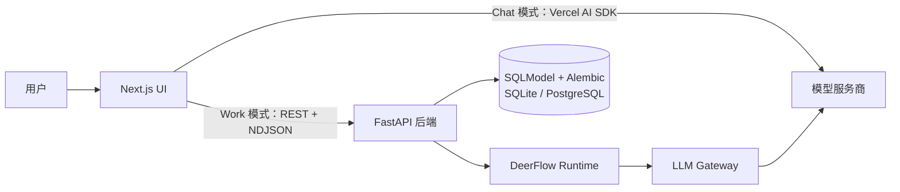

# SwarmMind

<!-- TODO: add logo -->

> **开源自托管的 Agent 聊天软件，普通 B/S 架构。**
> 直连模型聊天、跑 Agent 任务、用项目组织工作，并管理组织的账户、模型和 MCP 权限。

[](https://github.com/rongxinzy/SwarmMind/actions)
[](https://github.com/rongxinzy/SwarmMind/releases)
[](LICENSE)
[](https://www.python.org/)

[English](README.md) · [技术架构](docs/architecture.md) · [CLI](docs/cli.md) · [路线图](docs/roadmap.md) · [参与贡献](#参与贡献--社区)

---

## 这是什么

SwarmMind 是一个简单直接的 B/S 聊天应用，侧边栏顶部切换两个模式：

**Chat 模式** —— 直连模型对话。没有 Agent runtime，没有计划，没有编排。前端通过 Vercel AI SDK 连接模型；可用模型清单由管理员分配决定。

**Work 模式** —— Agent 工作。这里有两样东西：

- **任务**：由 [DeerFlow](https://github.com/hawkli-1994/deer-flow) runtime 执行的 Agent 会话。Agent 自主规划、调用工具和 MCP server，流式返回执行过程。
- **项目（Project）**：一个 workspace 文件夹，里面可以开多个任务会话，项目内所有会话共享项目记忆。

以及面向 admin 角色的**组织管理**：

- 两层结构：组织 → 团队 → 成员；
- 开账户、把成员分配到团队；
- 按组织 / 团队 / 成员分配配额和模型；
- 授予自定义 MCP server 权限。

这就是整个产品。没有审批流，没有连接器平台，没有模板市场，没有治理中心。

---

## 系统架构


```mermaid
flowchart LR
  U["用户"] --> UI["Next.js UI"]
  UI -->|"Chat 模式：Vercel AI SDK"| LLM["模型服务商"]
  UI -->|"Work 模式：REST + NDJSON"| API["FastAPI 后端"]
  API --> RT["DeerFlow Runtime"]
  RT --> GW["LLM Gateway"]
  GW --> LLM
  API --> DB[("SQLModel + Alembic<br/>SQLite / PostgreSQL")]
```

DeerFlow 只作为任务会话的执行内核；Chat 会话完全不经过它。

→ [完整架构文档](docs/architecture.md)

---

## 快速开始

**前置要求：** Python 3.12+、Node.js 20+、PostgreSQL 或本地 SQLite。

```bash
git clone https://github.com/rongxinzy/SwarmMind.git
cd SwarmMind
cp .env.example .env   # 填入 LLM 提供商密钥 + 数据库连接 URL
make install
make dev
```

启动后访问 [http://localhost:3000](http://localhost:3000)。

CLI 是与 Web UI 并列的一等接口：

```bash
swarmmind health
swarmmind user create ada@example.com --password "change-me-now" --role admin
swarmmind auth login ada@example.com --password "change-me-now"
swarmmind chat new "总结一下本周的事故报告"
swarmmind project list --json
```

命令、JSON/NDJSON 输出、退出码与 MCP 模式见 [CLI 文档](docs/cli.md)。

<!-- TODO: 补充 Chat / Work 双模式侧边栏截图 -->

---

## 项目状态

SwarmMind 当前版本 **v0.1.1**：早期阶段，持续迭代。

当前里程碑：

- **M0**：把历史遗留表面裁剪到只剩四个产品面。
- **M1**：Chat 模式 —— 基于 Vercel AI SDK 的直连模型对话。
- **M2**：任务会话 —— 运行在 DeerFlow runtime 上。
- **M3**：项目 —— workspace 文件夹、多会话、共享项目记忆。
- **M4**：组织管理 —— 团队、账户、配额、模型分配、MCP 授权。

→ [完整路线图](docs/roadmap.md)

---

## 参与贡献 · 社区

SwarmMind 基于 AGPL-3.0 开源，欢迎贡献。

- [贡献指南](CONTRIBUTING.md) *(即将发布)*
- [行为准则](CODE_OF_CONDUCT.md)
- [安全政策](SECURITY.md)
- [提交 Issue](https://github.com/rongxinzy/SwarmMind/issues/new/choose)

---

## 许可证

[GNU Affero 通用公共许可证 v3.0](LICENSE) — AGPL-3.0

---

## 致谢

任务执行层基于 [DeerFlow](https://github.com/hawkli-1994/deer-flow) 运行时构建。
