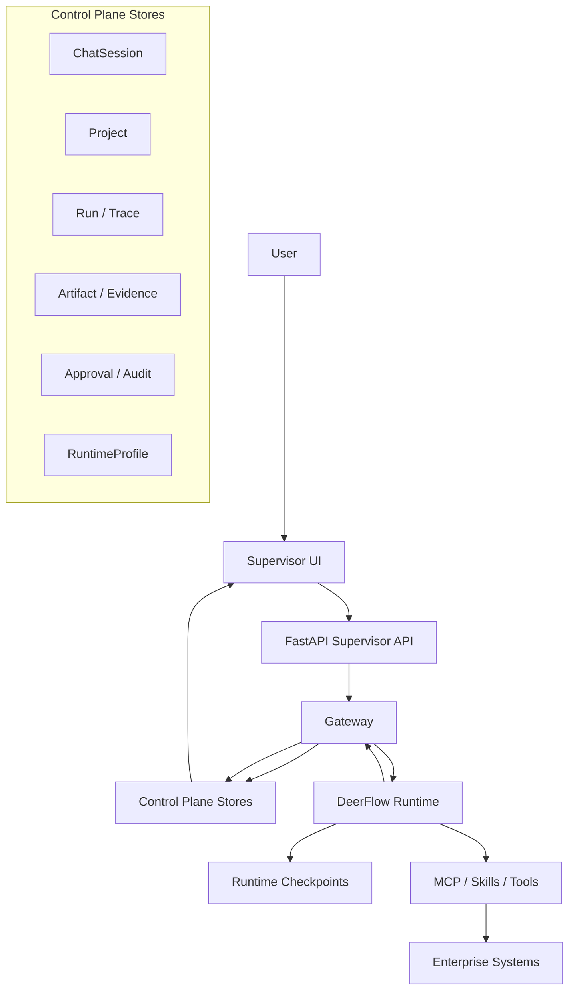

# Technical Architecture

> Document type: [A] target architecture.
> This document is the architecture baseline for SwarmMind. If implementation and this document conflict, prefer refactoring the implementation unless an explicit architecture decision changes this file first.

## 1. Terminology

SwarmMind separates product concepts from DeerFlow runtime concepts. Do not use bare `Agent` unless the sentence explicitly covers both layers.

| Term | Layer | Meaning |
|------|-------|---------|
| `ChatSession` | Control plane | Lightweight exploration surface for asking, clarifying, drafting, and producing candidate work. |
| `Project` | Control plane | Formal execution, collaboration, governance, artifact, and audit boundary. |
| `Agent Team` | Product model | User-facing mental model for a coordinated capability bundle. |
| `AgentTeamTemplate` | Control plane | Reusable team definition: roles, default workflow, skills, runtime profile preferences. |
| `ProjectAgentTeamInstance` | Control plane | A template instantiated inside one project with project-specific permissions and state. |
| `WorkflowTemplate` | Control plane | Reusable project/process scaffold. It is not a second workflow runtime. |
| `Run` | Control plane | One execution attempt, linked to a `ChatSession` or `Project`, with events and trace. |
| `Artifact` | Control plane | Durable project output such as PRD, plan, report, code artifact, or export. |
| `AuditLog` | Control plane | Governance history for approvals, risky actions, policy decisions, and recovery. |
| `Gateway` | Boundary | SwarmMind entry boundary that binds request context to DeerFlow runtime options. |
| `LeadAgentProfile` | Runtime mapping | Internal DeerFlow execution profile used to coordinate a task. |
| `RuntimeProfile` | Runtime config | Model, tool, skill, memory, and execution-mode configuration. |
| `RuntimeInstance` | Runtime config | A provisioned runtime bound to a profile and namespace. |
| `Namespace` | Runtime isolation | Runtime memory/checkpoint scope, usually `chat:{id}` or `project:{id}`. |

## 2. Core Principles

1. **DeerFlow is the only execution runtime.** SwarmMind does not introduce a second agent engine.
2. **SwarmMind is the control plane.** It owns identity, project boundaries, routing, approvals, traces, artifacts, and audit records.
3. **ChatSession is for exploration; Project is for execution and governance.**
4. **Agent Team is a product concept.** Internally it maps to `LeadAgentProfile`, runtime options, skills, and DeerFlow subagents.
5. **Workflow templates are scaffolds, not runtimes.** They create tasks and expectations; DeerFlow still executes.
6. **Project is the enterprise boundary.** RBAC, approvals, artifacts, runs, and audit all anchor on `project_id` once work becomes formal.
7. **Runtime memory is not control-plane truth.** DeerFlow checkpoints help execution; SwarmMind stores durable product state.
8. **Evidence beats claims.** User-facing conclusions should resolve to trace, source, artifact, or approval context.
9. **Approvals are for real risk.** Do not turn every action into proposal theater.
10. **Ship the main path before platform breadth.** Make `ChatSession -> Project -> governed execution` work before expanding pages.
11. **Configuration must be portable.** Paths, models, providers, and runtime options must be config-driven.

## 3. Target Architecture



The important boundary is not "frontend vs backend"; it is **control plane vs runtime**. DeerFlow may generate plans, call tools, and maintain checkpoints, but SwarmMind decides what becomes durable project state.

## 4. DeerFlow Execution Model

### 4.1 Gateway

The Gateway is the only path from SwarmMind product state into DeerFlow execution. It resolves:

- caller context: anonymous subject, user, project member, or approver;
- work boundary: `ChatSession` or `Project`;
- namespace: `chat:{conversation_id}` or `project:{project_id}`;
- runtime profile and model choice;
- mode options such as `thinking_enabled`, `plan_mode`, and `subagent_enabled`;
- policy and approval requirements before tool execution.

### 4.2 Namespace

Namespaces keep runtime state from leaking across contexts.

- `ChatSession` namespace: temporary exploration, resumable conversation, candidate artifacts.
- `Project` namespace: formal work, project runs, governed tool access, recoverable execution history.
- Promotion does not copy the raw runtime namespace wholesale. It creates a structured project summary and source reference.

### 4.3 Profile and Instance

- `RuntimeProfile` is the reusable configuration contract.
- `RuntimeInstance` is the provisioned runtime binding used for one namespace or pool.
- Phase A can use one default local profile.
- Later phases may pool instances by `tenant + runtime_profile_id`, but only after Project execution produces real load.

### 4.4 Lead Profile and Subagents

Users may see an `Agent Team`, but DeerFlow receives a default lead profile and optional subagent execution. The UI must translate runtime details into understandable work states: planning, researching, generating artifact, waiting for clarification, waiting for approval, completed, or blocked.

## 5. Control Plane Data Boundaries

These are logical store boundaries. A later implementation may split or merge physical tables, but the ownership rules should remain stable.

| Store group | Owns | Does not own |
|-------------|------|--------------|
| `ChatSessionStore` | conversations, messages, lightweight runtime binding, promotion source | formal project tasks or approvals |
| `ProjectStore` | project metadata, status, phase, goal, scope, constraints | raw DeerFlow checkpoints |
| `ProjectMembershipStore` | project members, roles, visibility, minimal RBAC | enterprise source-system permissions |
| `AgentTeamTemplateStore` | reusable team definitions and default capability bundles | project-specific runtime state |
| `ProjectTeamInstanceStore` | team template instantiated inside one project | a separate team runtime |
| `WorkflowAssetStore` | workflow templates, reusable playbooks, team assets | deterministic workflow execution |
| `RuntimeProfileStore` | model catalog, runtime profiles, assignments, defaults | provider CRUD platform in early phases |
| `TaskStore` | project task metadata, status, dependencies, human-readable assignment | hidden runtime todos without project value |
| `RunStore` | run records, structured event index, trace summaries, retry/resume metadata | full checkpoint ownership |
| `EvidenceStore` | artifacts, approvals, audit records, provenance snapshots, evidence links | downstream enterprise ACL source of truth |

Current Phase A has only a subset of this model implemented. The target shape exists to keep the next increments coherent, not to justify building every store immediately.

## 6. Lifecycle and Collaboration

### 6.1 ChatSession Main Path

1. User starts or resumes a `ChatSession`.
2. Gateway binds the conversation to a DeerFlow thread and runtime options.
3. Stream events are translated into UI semantic events.
4. Messages, title metadata, run identifiers, and trace references are persisted.
5. Valuable sessions can be promoted to `Project` through semantic compression.

Phase A should make this path reliable before expanding platform surfaces.

### 6.2 Promote to Project

Promotion is the handoff from exploration to formal work.

- Input: conversation messages, assistant outputs, trace summary, candidate artifacts.
- Output: project title, goal summary, scope, constraints, source conversation reference, next-step suggestion.
- Rule: the source ChatSession remains available as provenance. The Project receives structured state, not a copied chat thread.

### 6.3 Project Execution Path

1. A `Project` owns goal, scope, status, members, and governance context.
2. A `ProjectAgentTeamInstance` may be attached.
3. The Gateway binds project requests to runtime namespace and profile.
4. Runs produce events, artifacts, task updates, approval requests, and audit records.
5. Project pages render the control-plane view, not raw DeerFlow state.

### 6.4 Concurrency and Failure

- Multiple runs may exist, but one project surface must clearly show active, waiting, blocked, and completed states.
- Retrying creates a new run unless explicit resume metadata is available.
- Tool calls with side effects need idempotency keys or deterministic side-effect boundaries.
- Runtime failure should leave a recoverable control-plane record.

## 7. Routing and Approval

### 7.1 Routing

Phase A can use keyword routing and a simple strategy table. Later phases may introduce embedding or classifier routing after enough labeled outcomes exist.

Routing must be observable:

- input goal;
- selected situation tag or route;
- selected runtime profile;
- selected tools or skills;
- outcome and failure class.

### 7.2 Approval

Approval applies to risky execution, not every intermediate thought.

Risk tiers:

- low: read-only, public or project-approved context;
- medium: project-scoped internal context or reversible write;
- high: sensitive data access, external write, broad export, destructive action, or policy change.

High-risk runs pause and create approval context with `project_id`, `run_id`, requested capability, evidence, impact, approver role, and recovery behavior. Approval decisions must write audit records and unblock, reject, or require revision.

## 8. Non-Goals

SwarmMind should not spend near-term effort on:

- a second execution engine beside DeerFlow;
- generic "many agents talking" demos;
- full workflow-engine semantics;
- provider-management SaaS screens before the main path works;
- full organization/user/RBAC platform before Project needs it;
- broad placeholder pages that do not advance `ChatSession -> Project -> governed execution`;
- duplicating permissions from downstream enterprise systems;
- exposing raw DeerFlow terminology as product UX.

## 9. Implementation Roadmap

### Phase A: Current Foundation

Goal: make the ChatSession work surface dependable.

- conversation persistence and recovery;
- stream event translation;
- DeerFlow runtime bootstrap;
- runtime model catalog foundation;
- trace reconstruction foundation;
- supervisor UI shell.

### Phase B: Main Path Closure

Goal: close `ChatSession -> Project`.

- minimal Project model and repository;
- semantic Promote to Project;
- Project page that renders real project data;
- trace summary tied to assistant messages and runs;
- minimal artifact/evidence handoff;
- model picker that uses capability language.

### Phase C: Governed Project Execution

Goal: make Project the enterprise execution boundary.

- project task/run/artifact stores;
- project member roles and minimal RBAC;
- high-risk approval flow;
- audit log and replay surfaces;
- AgentTeamTemplate to ProjectAgentTeamInstance;
- workflow templates as project scaffolds.

### Phase D: Enterprise Scale

Goal: scale governance after the main path has proven value.

- connector framework for priority enterprise systems;
- policy versioning and evaluation loops;
- runtime pool by `tenant + runtime_profile_id`;
- richer router using classifier or embeddings;
- field-level profile projection;
- private skill/plugin governance.

## 10. Target Directory Structure

```text
swarmmind/
  api/                  # FastAPI assembly and route modules
  services/             # orchestration boundaries and application services
  repositories/         # SQLModel repositories per control-plane store
  runtime/              # DeerFlow bootstrap, profiles, catalog, errors
  agents/               # DeerFlow adapter boundary and compatibility aliases
  models.py             # API/service Pydantic models
  db_models.py          # SQLModel table definitions
  db.py                 # engine, migrations, session scope

ui/src/
  components/workspace/ # ChatSession, Project, artifact, trace surfaces
  components/ui/        # shadcn-style primitives and shared UI components
  core/chat/            # chat stream, mode, scroll, and type helpers
  core/artifacts/       # artifact helpers

docs/
  architecture.md       # target architecture baseline
  roadmap.md            # pragmatic phase plan
  product-positioning.md
  ui/                   # product wireframes and interaction rules
```

## 11. Pragmatism Gates

Before accepting a new architectural increment, answer yes to all of these:

1. Does it improve the `ChatSession -> Project -> governed execution` path?
2. Is the product concept clear without exposing DeerFlow internals?
3. Does it preserve DeerFlow as the only runtime?
4. Does it create durable control-plane state only where users or governance need it?
5. Can it ship as a small vertical slice with tests and rollback behavior?

If the answer is no, the work is probably platform breadth and should wait.
